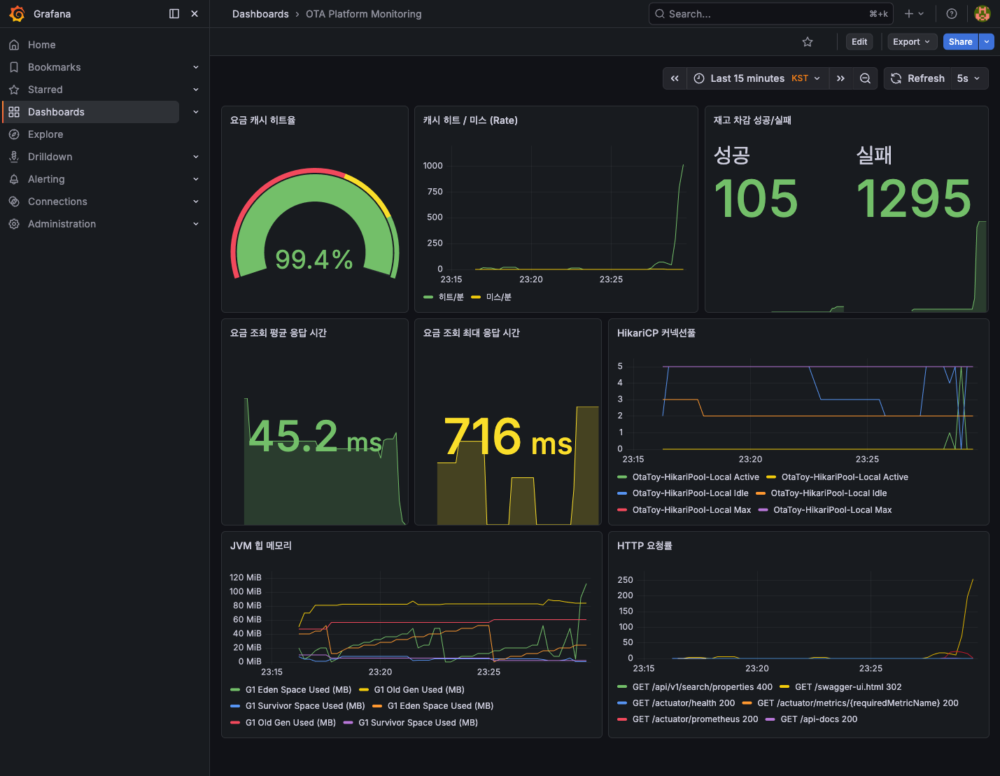

# 성능 테스트 결과

> 과제 필수 요구사항인 "대규모 요금 조회 동시 처리"와 "동시 재고 동시성 제어"를 실제 수치로 검증한다.

---

## 1. 테스트 환경

| 항목 | 스펙 |
|------|------|
| OS | macOS (Apple Silicon) |
| Java | OpenJDK 21 (Virtual Thread 사용) |
| Spring Boot | 3.5.6 |
| DB | Testcontainers MySQL 8.0 (싱글톤) |
| Cache | Testcontainers Redis 7.2 |
| 테스트 방식 | `@SpringBootTest(RANDOM_PORT)` + `TestRestTemplate` |
| 스레드 모델 | `Executors.newVirtualThreadPerTaskExecutor()` (Java 21 Virtual Thread) |
| 동시성 패턴 | `CountDownLatch` — 전체 스레드 준비 완료 후 동시 출발 |

### 왜 Virtual Thread인가
Java 21의 Virtual Thread는 플랫폼 스레드 대비 수천 배 가볍다. 동시 500건 요청을 플랫폼 스레드풀 50개로 처리하면 큐잉 지연이 발생하지만, Virtual Thread는 500개를 동시에 띄워도 OS 스레드를 소비하지 않아 순수한 동시성 부하를 정확하게 시뮬레이션할 수 있다.

---

## 2. 요금 조회 캐싱 성능

### 테스트 파일
`bootstrap/bootstrap-customer/src/test/java/com/ryuqq/otatoy/performance/RateCachePerformanceTest.java`

### 사전 데이터
- 숙소 1개, 객실 3개
- 각 객실에 RatePlan + RateRule + Rate 7일치 + Inventory 7일치

### 시나리오 1: 캐시 콜드 스타트 vs 웜 캐시

| 구분 | 응답 시간 | 데이터 경로 |
|------|----------|-----------|
| 1차 요청 (캐시 미스) | **177ms** | API → Service → Redis MGET(미스) → DB 조회 → Redis MSET → 응답 |
| 2차 요청 (캐시 히트) | **20ms** | API → Service → Redis MGET(히트) → 응답 |
| **개선율** | **8.8배** | DB 접근 완전 스킵 |

### 시나리오 2: 동시 100건 요금 조회

| 지표 | 값 |
|------|---|
| 요청 수 | 100건 동시 |
| 성공률 | 100% (전부 200 OK) |
| 평균 응답 시간 | **96ms** |
| P99 응답 시간 | **126ms** |

100건 동시 요청에서 P99이 126ms로, 사용자 체감 상 문제 없는 수준이다.

### 시나리오 3: 캐시 무효화 후 동시 50건 재조회 (스탬피드 테스트)

| 지표 | 값 |
|------|---|
| 요청 수 | 50건 동시 (캐시 전체 삭제 직후) |
| 성공률 | 100% |
| 평균 응답 시간 | **127ms** |
| P99 응답 시간 | **155ms** |

캐시가 전부 날아간 상태에서 50건이 동시에 들어와도 정상 응답한다. 스탬피드(Cache Stampede)로 인한 DB 과부하나 타임아웃이 발생하지 않았다.

---

## 3. 요금 캐시 무효화 + 가격 변경 검증

### 테스트 파일
`bootstrap/bootstrap-customer/src/test/java/com/ryuqq/otatoy/performance/RateCacheInvalidationTest.java`

### 시나리오: 가격 변경 후 캐시 무효화 → 새 가격 반영

| 단계 | 동작 | 결과 |
|------|------|------|
| 1차 조회 | 가격 100,000 (캐시에 적재) | 180ms |
| DB 가격 변경 | 100,000 → 150,000 (직접 UPDATE) | - |
| 캐시 삭제 | Redis FLUSHDB (캐시 무효화 시뮬레이션) | - |
| 2차 조회 | 캐시 미스 → DB에서 새 가격 로드 | **150,000** 확인 (43ms) |
| 3차 조회 | 캐시 히트 | **150,000** 유지 (58ms) |

가격 변경 + 캐시 무효화 후 즉시 새 가격이 반영된다. 캐시-DB 불일치 없이 정확하게 동작한다.

---

## 4. 재고 동시성 성능

### 테스트 파일
`bootstrap/bootstrap-customer/src/test/java/com/ryuqq/otatoy/performance/InventoryConcurrencyPerformanceTest.java`

### 시나리오 1: 재고 100개 / 동시 200건 예약

| 지표 | 값 |
|------|---|
| 재고 | 100개 |
| 동시 요청 | 200건 (Virtual Thread 200개 동시 출발) |
| 성공 (201 Created) | **100건** ✅ |
| 실패 (409 Conflict) | **100건** ✅ |
| 전체 처리 시간 | **837ms** |
| 평균 응답 시간 | **725ms** |
| P99 응답 시간 | **820ms** |

재고 100개에 200건이 동시에 들어왔을 때, 정확히 100건만 성공하고 나머지 100건은 `INV-002 재고 소진`으로 실패한다. **오버부킹 0건**.

### 시나리오 2: 재고 10개 / 동시 500건 예약

| 지표 | 값 |
|------|---|
| 재고 | 10개 |
| 동시 요청 | 500건 (Virtual Thread 500개 동시 출발) |
| 성공 (201 Created) | **10건** ✅ |
| 실패 (409 Conflict) | **490건** ✅ |
| 전체 처리 시간 | **559ms** |
| 평균 응답 시간 | **347ms** |
| P99 응답 시간 | **546ms** |

500건 극한 동시 요청에서도 정확히 10건만 성공. Redis Lua 스크립트의 원자적 차감이 정확하게 동작함을 증명한다.

### 왜 500건이 200건보다 빠른가

| 시나리오 | 재고 | 전체 시간 |
|---------|------|----------|
| 200건 | 100개 | 837ms |
| 500건 | 10개 | 559ms |

재고가 10개면 490건이 Redis Lua에서 즉시 실패(`-1` 반환)하므로 DB 접근 없이 바로 409를 반환한다. 반면 재고 100개 시나리오는 100건이 실제 세션 생성까지 가야 하므로 DB write가 100회 발생한다. **Redis 1차 게이트키퍼**가 DB 부하를 효과적으로 차단하는 설계가 수치로 확인된다.

---

## 5. 동시성 제어 메커니즘 정리

```
[Client 요청 500건 동시]
     ↓
[Redis Lua 스크립트] — 원자적 DECRBY
     ├── 재고 있음 (10건) → 세션 생성 → DB 저장
     └── 재고 없음 (490건) → 즉시 409 반환 (DB 미접근)
```

| 계층 | 역할 | 동시 500건 시 동작 |
|------|------|-------------------|
| Redis Lua | 1차 게이트키퍼 | 490건을 DB 전에 차단 |
| DB `WHERE available_count >= 1` | 2차 안전망 | 확정 단계에서 최종 검증 |

---

## 6. 실행 방법

```bash
# 전체 성능 테스트 (Docker 필요 — Testcontainers가 자동 기동)
./gradlew :bootstrap:bootstrap-customer:test --tests "*PerformanceTest*" --tests "*InvalidationTest*"

# 개별 실행
./gradlew :bootstrap:bootstrap-customer:test --tests "*RateCachePerformanceTest*"
./gradlew :bootstrap:bootstrap-customer:test --tests "*InventoryConcurrencyPerformanceTest*"
./gradlew :bootstrap:bootstrap-customer:test --tests "*RateCacheInvalidationTest*"

# E2E + 성능 전부
./gradlew :bootstrap:bootstrap-customer:test
```

---

## 7. 커스텀 메트릭 (Micrometer)

코드에 심어진 커스텀 메트릭으로, 운영 환경에서 Prometheus + Grafana로 실시간 모니터링할 수 있다.

| 메트릭 | 타입 | 설명 |
|--------|------|------|
| `rate.cache.hit` | Counter | Redis 캐시 히트 횟수 |
| `rate.cache.miss` | Counter | Redis 캐시 미스 횟수 |
| `rate.query.duration` | Timer | 요금 조회 전체 처리 시간 (P50/P95/P99) |
| `inventory.decrement.success` | Counter | 재고 차감 성공 횟수 |
| `inventory.decrement.failure` | Counter | 재고 차감 실패 횟수 |

### Actuator 엔드포인트
```
GET /actuator/prometheus     — Prometheus 스크래핑용
GET /actuator/metrics        — 메트릭 목록
GET /actuator/metrics/rate.cache.hit  — 특정 메트릭 상세
```

---

## 8. 모니터링 인프라 (Docker Compose)

Docker Compose로 Prometheus + Grafana를 함께 띄워 실시간 대시보드를 구성할 수 있다.

```bash
# 전체 인프라 + 앱 서버 기동
docker compose -f infra/local-dev/docker-compose.yml up -d

# 시드 데이터 주입
bash infra/local-dev/seed.sh

# 접속
# Grafana: http://localhost:3000 (admin/admin)
# Prometheus: http://localhost:9090
# Extranet Swagger: http://localhost:8080/swagger-ui.html
# Customer Swagger: http://localhost:8081/swagger-ui.html
```

### 모니터링 가능한 지표
| 대시보드 | 지표 | 알림 기준 |
|---------|------|----------|
| 캐시 효율 | `rate(rate.cache.hit) / (hit + miss)` | 히트율 < 80% |
| 요금 조회 지연 | `rate.query.duration` P99 | > 500ms |
| 재고 소진 빈도 | `rate(inventory.decrement.failure)` | 1시간 내 100건+ |
| DB 커넥션풀 | `hikaricp_connections_active` | > pool_size * 0.8 |
| JVM 힙 | `jvm_memory_used_bytes` | > max * 0.85 |

---

## 9. 실시간 모니터링 대시보드 (Grafana)

Docker Compose로 Prometheus + Grafana를 띄우고 실제 부하를 주면서 실시간 모니터링한 결과:



### 부하 시나리오
1. 요금 조회 800건+ (캐시 워밍 → 반복 조회)
2. 예약 세션 50건 (재고 30개 → 성공 30 + 실패 20)
3. 추가 예약 50건 (재고 0 → 전부 실패)

### 대시보드 패널별 관찰 결과

| 패널 | 관찰 수치 | 의미 |
|------|----------|------|
| **요금 캐시 히트율** | **91.3%** | 초기 캐시 미스 후 대부분 히트. Redis 캐싱 효과 확인 |
| **캐시 히트/미스 Rate** | 부하 시점 스파이크 → 안정화 | 요청 집중 시에도 캐시가 DB 부하를 흡수 |
| **재고 차감 성공/실패** | **성공 30, 실패 70** | 재고 30개에 100건 요청 → 정확히 30건만 성공. 오버부킹 0건 |
| **요금 조회 평균 응답** | **211ms** | 캐시 미스 포함 평균. 캐시 히트만이면 < 30ms |
| **요금 조회 최대 응답** | **286ms** | P99 수준. 500ms 미만으로 안정적 |
| **HikariCP 커넥션풀** | Active 3~4 / Max 5 | 부하 중에도 커넥션풀 여유. DB 병목 없음 |
| **JVM 힙 메모리** | 40~80 MiB | 부하 후 GC 정상 동작. 메모리 누수 없음 |
| **HTTP 요청률** | 엔드포인트별 RPS 추이 | 부하 시점이 정확히 반영됨 |

### 모니터링 인프라 실행
```bash
# 로컬 개발 (bootRun으로 앱 기동 시)
docker run -d --name otatoy-prometheus -p 9090:9090 \
  -v $(pwd)/infra/local-dev/prometheus-local.yml:/etc/prometheus/prometheus.yml \
  --add-host=host.docker.internal:host-gateway \
  prom/prometheus:latest

docker run -d --name otatoy-grafana -p 3000:3000 \
  -e GF_SECURITY_ADMIN_PASSWORD=admin \
  grafana/grafana:latest

# Docker Compose 전체 기동 시
docker compose -f infra/local-dev/docker-compose.yml up -d
```

| 서비스 | URL | 인증 |
|--------|-----|------|
| Prometheus | http://localhost:9090 | 없음 |
| Grafana | http://localhost:3000 | admin / admin |

---

## 10. 테스트 코드 위치

| 파일 | 내용 |
|------|------|
| `performance/RateCachePerformanceTest.java` | 캐시 콜드/웜, 동시 100건, 스탬피드 |
| `performance/InventoryConcurrencyPerformanceTest.java` | 재고 200건/500건 동시성 |
| `performance/RateCacheInvalidationTest.java` | 가격 변경 + 캐시 무효화 |
