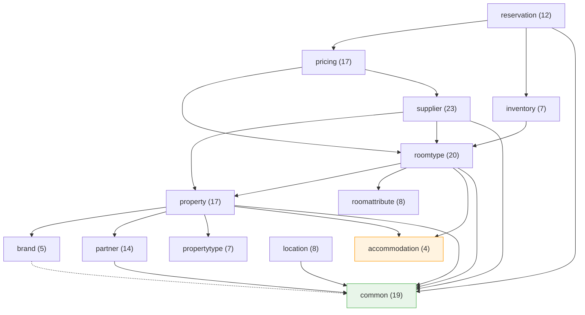

# 도메인 객체 연관관계

> 이 문서는 OTA-TOY 프로젝트의 도메인 레이어에서 BC(Bounded Context) 간 의존 관계,
> Aggregate 내부 구조, BC 간 ID 참조, 공유 타입 사용처를 정리한다.
> 실제 코드 기준으로 작성되었으며, 코드 변경 시 이 문서도 함께 갱신해야 한다.

---

## 1. BC 의존 관계도



> 화살표 방향: `A --> B`는 A가 B의 ID VO 또는 공유 타입을 import한다는 의미

---

## 2. BC별 Aggregate 내부 구조

### 2.1 property BC

| 구분 | 클래스 | 주요 필드 | 설명 |
|------|--------|-----------|------|
| **Aggregate Root** | `Property` | PropertyId, PartnerId, BrandId, PropertyTypeId, PropertyName, PropertyDescription, Location, PromotionText, PropertyStatus | 숙소 핵심 정보 |
| 하위 엔티티 | `PropertyAmenity` | PropertyAmenityId, PropertyId, AmenityType, AmenityName, Money, sortOrder | 숙소 편의시설 |
| 하위 엔티티 | `PropertyPhoto` | PropertyPhotoId, PropertyId, PhotoType, OriginUrl, CdnUrl, sortOrder | 숙소 사진 |
| 하위 엔티티 | `PropertyAttributeValue` | PropertyAttributeValueId, PropertyId, PropertyTypeAttributeId, value | EAV 패턴 속성값 |
| 래핑 컬렉션 VO | `PropertyAmenities` | List\<PropertyAmenity\> | 정렬순서 중복 검증 |
| 래핑 컬렉션 VO | `PropertyPhotos` | List\<PropertyPhoto\> | 정렬순서 중복 검증 |
| 래핑 컬렉션 VO | `PropertyAttributeValues` | List\<PropertyAttributeValue\> | 속성 ID 중복 검증 |
| Value Object | `Location` | address, Coordinate, neighborhood, region | record 타입, 주소/좌표 |
| Value Object | `PropertyName` | String value | 숙소명 래핑 |
| Value Object | `PropertyDescription` | String value | 숙소 설명 래핑 |
| Value Object | `PromotionText` | String value | 프로모션 문구 래핑 |
| ID VO | `PropertyId` | Long value | 숙소 식별자 |
| Enum | `PropertyStatus` | ACTIVE, INACTIVE | 숙소 상태 |

### 2.2 roomtype BC

| 구분 | 클래스 | 주요 필드 | 설명 |
|------|--------|-----------|------|
| **Aggregate Root** | `RoomType` | RoomTypeId, PropertyId, RoomTypeName, RoomTypeDescription, areaSqm, areaPyeong, baseOccupancy, maxOccupancy, baseInventory, checkInTime, checkOutTime, RoomTypeStatus | 객실 유형 핵심 정보 |
| 하위 엔티티 | `RoomAmenity` | RoomAmenityId, RoomTypeId, AmenityType, AmenityName, Money, sortOrder | 객실 편의시설 |
| 하위 엔티티 | `RoomPhoto` | RoomPhotoId, RoomTypeId, PhotoType, OriginUrl, CdnUrl, sortOrder | 객실 사진 |
| 하위 엔티티 | `RoomTypeBed` | RoomTypeBedId, RoomTypeId, BedTypeId, quantity | 객실 침대 구성 |
| 하위 엔티티 | `RoomTypeView` | RoomTypeViewId, RoomTypeId, ViewTypeId | 객실 전망 매핑 |
| 하위 엔티티 | `RoomTypeAttribute` | RoomTypeAttributeId, RoomTypeId, attributeKey, attributeValue | 객실 추가 속성 (Key-Value) |
| 래핑 컬렉션 VO | `RoomAmenities` | List\<RoomAmenity\> | 정렬순서 중복 검증 |
| 래핑 컬렉션 VO | `RoomPhotos` | List\<RoomPhoto\> | 정렬순서 중복 검증 |
| 래핑 컬렉션 VO | `RoomTypeBeds` | List\<RoomTypeBed\> | 침대유형 중복 검증, totalQuantity() |
| 래핑 컬렉션 VO | `RoomTypeViews` | List\<RoomTypeView\> | 전망유형 중복 검증 |
| 래핑 컬렉션 VO | `RoomTypeAttributes` | List\<RoomTypeAttribute\> | 속성키 중복 검증 |
| ID VO | `RoomTypeId` | Long value | 객실유형 식별자 |
| Enum | `RoomTypeStatus` | ACTIVE, INACTIVE | 객실유형 상태 |

### 2.3 propertytype BC

| 구분 | 클래스 | 주요 필드 | 설명 |
|------|--------|-----------|------|
| **Aggregate Root** | `PropertyType` | PropertyTypeId, PropertyTypeCode, PropertyTypeName, PropertyTypeDescription | 숙소 유형 (호텔, 모텔, 리조트 등) |
| 하위 엔티티 | `PropertyTypeAttribute` | PropertyTypeAttributeId, PropertyTypeId, attributeKey, attributeName, valueType, required, sortOrder | 유형별 EAV 속성 정의 |
| ID VO | `PropertyTypeId` | Long value | 숙소유형 식별자 |
| ID VO | `PropertyTypeAttributeId` | Long value | 숙소유형 속성 식별자 |
| VO | `PropertyTypeCode` | String value | 유형 코드 |
| VO | `PropertyTypeName` | String value | 유형명 |
| VO | `PropertyTypeDescription` | String value | 유형 설명 |

### 2.4 roomattribute BC

| 구분 | 클래스 | 주요 필드 | 설명 |
|------|--------|-----------|------|
| **Aggregate Root** | `BedType` | BedTypeId, BedTypeCode, BedTypeName | 침대 유형 마스터 |
| **Aggregate Root** | `ViewType` | ViewTypeId, ViewTypeCode, ViewTypeName | 전망 유형 마스터 |
| ID VO | `BedTypeId` | Long value | 침대유형 식별자 |
| ID VO | `ViewTypeId` | Long value | 전망유형 식별자 |

### 2.5 brand BC

| 구분 | 클래스 | 주요 필드 | 설명 |
|------|--------|-----------|------|
| **Aggregate Root** | `Brand` | BrandId, BrandName, BrandNameKr, LogoUrl | 브랜드 마스터 |
| ID VO | `BrandId` | Long value | 브랜드 식별자 |
| VO | `BrandName` | String value | 브랜드 영문명 |
| VO | `BrandNameKr` | String value | 브랜드 한글명 |
| VO | `LogoUrl` | String value | 로고 URL |

### 2.6 pricing BC

| 구분 | 클래스 | 주요 필드 | 설명 |
|------|--------|-----------|------|
| **Aggregate Root** | `RatePlan` | RatePlanId, RoomTypeId, RatePlanName, SourceType, SupplierId, CancellationPolicy, PaymentPolicy | 요금 정책 |
| 하위 엔티티 | `RateRule` | RateRuleId, RatePlanId, startDate, endDate, basePrice, weekdayPrice, fridayPrice, saturdayPrice, sundayPrice | 기간별 요일 가격 규칙 |
| 하위 엔티티 | `RateOverride` | RateOverrideId, RateRuleId, overrideDate, price, reason | 특정일 가격 오버라이드 |
| 하위 엔티티 | `Rate` | RateId, RatePlanId, rateDate, basePrice | 날짜별 확정 요금 |
| 하위 엔티티 | `RatePlanAddOn` | RatePlanAddOnId, RatePlanId, AddOnType, AddOnName, price, included | 부가 서비스 (조식 등) |
| Value Object | `CancellationPolicy` | freeCancellation, nonRefundable, deadlineDays, policyText | record 타입, 취소 정책 |
| ID VO | `RatePlanId` | Long value | 요금정책 식별자 |
| Enum | `SourceType` | DIRECT, SUPPLIER | 요금 출처 |
| Enum | `PaymentPolicy` | - | 결제 방식 |
| Enum | `AddOnType` | - | 부가서비스 유형 |

### 2.7 inventory BC

| 구분 | 클래스 | 주요 필드 | 설명 |
|------|--------|-----------|------|
| **Aggregate Root** | `Inventory` | InventoryId, RoomTypeId, inventoryDate, availableCount, stopSell, version | 날짜별 재고 |
| ID VO | `InventoryId` | Long value | 재고 식별자 |

> 낙관적 락(version) 필드를 도메인에 보유하며, Persistence 레이어에서 @Version으로 매핑한다.

### 2.8 reservation BC

| 구분 | 클래스 | 주요 필드 | 설명 |
|------|--------|-----------|------|
| **Aggregate Root** | `Reservation` | ReservationId, RatePlanId, ReservationNo, GuestInfo, DateRange, guestCount, Money, ReservationStatus, cancelReason, bookingSnapshot, List\<ReservationItem\> | 예약 |
| 하위 엔티티 | `ReservationItem` | ReservationItemId, ReservationId, InventoryId, stayDate | 예약 항목 (날짜별 재고 매핑) |
| Value Object | `GuestInfo` | name, phone, email | record 타입, 투숙객 정보 |
| Value Object | `ReservationNo` | String value | 예약 번호 |
| ID VO | `ReservationId` | Long value | 예약 식별자 |
| Enum | `ReservationStatus` | PENDING, CONFIRMED, CANCELLED, COMPLETED, NO_SHOW | 예약 상태 (상태 전이 메서드 보유) |

### 2.9 partner BC

| 구분 | 클래스 | 주요 필드 | 설명 |
|------|--------|-----------|------|
| **Aggregate Root** | `Partner` | PartnerId, PartnerName, PartnerStatus | 파트너 (숙소 운영자) |
| 하위 엔티티 | `PartnerMember` | PartnerMemberId, PartnerId, MemberName, Email, PhoneNumber, PartnerMemberRole, PartnerMemberStatus | 파트너 소속 멤버 |
| ID VO | `PartnerId` | Long value | 파트너 식별자 |
| Enum | `PartnerStatus` | ACTIVE, SUSPENDED | 파트너 상태 (상태 전이 메서드 보유) |
| Enum | `PartnerMemberRole` | - | 멤버 역할 |
| Enum | `PartnerMemberStatus` | ACTIVE, SUSPENDED | 멤버 상태 |

### 2.10 supplier BC

| 구분 | 클래스 | 주요 필드 | 설명 |
|------|--------|-----------|------|
| **Aggregate Root** | `Supplier` | SupplierId, SupplierName, SupplierNameKr, CompanyTitle, OwnerName, BusinessNo, address, PhoneNumber, Email, termsUrl, SupplierStatus | 외부 공급자 |
| 하위 엔티티 | `SupplierProperty` | SupplierPropertyId, SupplierId, PropertyId, supplierPropertyCode, lastSyncedAt, SupplierMappingStatus | 공급자-숙소 매핑 |
| 하위 엔티티 | `SupplierRoomType` | SupplierRoomTypeId, SupplierPropertyId, RoomTypeId, supplierRoomCode, lastSyncedAt, SupplierMappingStatus | 공급자-객실 매핑 |
| 하위 엔티티 | `SupplierSyncLog` | SupplierSyncLogId, SupplierId, SupplierSyncType, syncedAt, SupplierSyncStatus, totalCount, createdCount, updatedCount, deletedCount, errorMessage | 동기화 이력 |
| ID VO | `SupplierId` | Long value | 공급자 식별자 |
| Enum | `SupplierStatus` | ACTIVE, SUSPENDED, TERMINATED | 공급자 상태 (상태 전이 메서드 보유) |
| Enum | `SupplierMappingStatus` | MAPPED, UNMAPPED | 매핑 상태 |
| Enum | `SupplierSyncType` | - | 동기화 유형 |
| Enum | `SupplierSyncStatus` | SUCCESS, FAILED | 동기화 결과 |

### 2.11 location BC

| 구분 | 클래스 | 주요 필드 | 설명 |
|------|--------|-----------|------|
| **Aggregate Root** | `Landmark` | LandmarkId, LandmarkName, LandmarkType, Coordinate | 랜드마크 |
| 하위 엔티티 | `PropertyLandmark` | PropertyLandmarkId, long propertyId, LandmarkId, distanceKm, walkingMinutes | 숙소-랜드마크 거리 매핑 |
| ID VO | `LandmarkId` | Long value | 랜드마크 식별자 |
| Enum | `LandmarkType` | - | 랜드마크 유형 |

> PropertyLandmark는 `long propertyId`로 property BC를 참조한다 (ID VO가 아닌 primitive 타입).
> 이는 location BC가 property BC에 대한 컴파일 의존을 갖지 않기 위한 의도적 설계이다.

---

## 3. BC 간 참조 관계

아래 테이블은 특정 BC의 ID VO가 다른 BC에서 어떻게 참조되는지를 정리한다.

### 3.1 ID VO 참조 매핑

| 원본 BC | ID VO | 참조하는 BC | 참조하는 클래스.필드 | 참조 방식 |
|---------|-------|------------|---------------------|-----------|
| property | `PropertyId` | roomtype | `RoomType.propertyId` | ID VO import |
| property | `PropertyId` | supplier | `SupplierProperty.propertyId` | ID VO import |
| property | `PropertyId` | location | `PropertyLandmark.propertyId` | long primitive |
| roomtype | `RoomTypeId` | pricing | `RatePlan.roomTypeId` | ID VO import |
| roomtype | `RoomTypeId` | inventory | `Inventory.roomTypeId` | ID VO import |
| roomtype | `RoomTypeId` | supplier | `SupplierRoomType.roomTypeId` | ID VO import |
| brand | `BrandId` | property | `Property.brandId` | ID VO import |
| partner | `PartnerId` | property | `Property.partnerId` | ID VO import |
| propertytype | `PropertyTypeId` | property | `Property.propertyTypeId` | ID VO import |
| propertytype | `PropertyTypeAttributeId` | property | `PropertyAttributeValue.propertyTypeAttributeId` | ID VO import |
| roomattribute | `BedTypeId` | roomtype | `RoomTypeBed.bedTypeId` | ID VO import |
| roomattribute | `ViewTypeId` | roomtype | `RoomTypeView.viewTypeId` | ID VO import |
| pricing | `RatePlanId` | reservation | `Reservation.ratePlanId` | ID VO import |
| pricing | `RatePlanId` | pricing | `RateRule.ratePlanId`, `Rate.ratePlanId`, `RatePlanAddOn.ratePlanId` | Aggregate 내부 |
| pricing | `RateRuleId` | pricing | `RateOverride.rateRuleId` | Aggregate 내부 |
| inventory | `InventoryId` | reservation | `ReservationItem.inventoryId` | ID VO import |
| supplier | `SupplierId` | pricing | `RatePlan.supplierId` | ID VO import |
| supplier | `SupplierPropertyId` | supplier | `SupplierRoomType.supplierPropertyId` | Aggregate 내부 |
| location | `LandmarkId` | location | `PropertyLandmark.landmarkId` | Aggregate 내부 |

### 3.2 참조 방향 요약

```
partner ──PartnerId──> property
brand ──BrandId──> property
propertytype ──PropertyTypeId, PropertyTypeAttributeId──> property
property ──PropertyId──> roomtype, supplier, location(primitive)
roomattribute ──BedTypeId, ViewTypeId──> roomtype
roomtype ──RoomTypeId──> pricing, inventory, supplier
supplier ──SupplierId──> pricing
pricing ──RatePlanId──> reservation
inventory ──InventoryId──> reservation
```

---

## 4. 공유 타입

### 4.1 accommodation 패키지 (공유 Enum/VO)

`com.ryuqq.otatoy.domain.accommodation` 패키지는 property와 roomtype이 공통으로 사용하는 Enum/VO를 제공한다.

| 타입 | 종류 | 사용하는 BC | 사용하는 클래스 |
|------|------|------------|----------------|
| `AmenityType` | Enum | property | `PropertyAmenity.amenityType` |
| `AmenityType` | Enum | roomtype | `RoomAmenity.amenityType` |
| `AmenityName` | VO | property | `PropertyAmenity.name` |
| `AmenityName` | VO | roomtype | `RoomAmenity.name` |
| `PhotoType` | Enum | property | `PropertyPhoto.photoType` |
| `PhotoType` | Enum | roomtype | `RoomPhoto.photoType` |
| `AccommodationErrorCode` | ErrorCode | - | 공용 에러 코드 |

### 4.2 common 패키지 (공유 VO)

`com.ryuqq.otatoy.domain.common.vo` 패키지는 전체 도메인에서 사용하는 범용 VO를 제공한다.

| 타입 | 종류 | 사용하는 BC | 사용하는 클래스 |
|------|------|------------|----------------|
| `Money` | record VO | property | `PropertyAmenity.additionalPrice` |
| `Money` | record VO | roomtype | `RoomAmenity.additionalPrice` |
| `Money` | record VO | reservation | `Reservation.totalAmount` |
| `Coordinate` | record VO | property | `Location.coordinate` |
| `Coordinate` | record VO | location | `Landmark.coordinate` |
| `DateRange` | record VO | reservation | `Reservation.stayPeriod` |
| `Email` | record VO | partner | `PartnerMember.email` |
| `Email` | record VO | supplier | `Supplier.email` |
| `PhoneNumber` | record VO | partner | `PartnerMember.phone` |
| `PhoneNumber` | record VO | supplier | `Supplier.phone` |
| `OriginUrl` | record VO | property | `PropertyPhoto.originUrl` |
| `OriginUrl` | record VO | roomtype | `RoomPhoto.originUrl` |
| `CdnUrl` | record VO | property | `PropertyPhoto.cdnUrl` |
| `CdnUrl` | record VO | roomtype | `RoomPhoto.cdnUrl` |
| `DeletionStatus` | Enum | - | 논리 삭제 상태 (범용) |

### 4.3 common 패키지 (기반 클래스)

| 타입 | 종류 | 설명 |
|------|------|------|
| `DomainException` | 추상 클래스 | 모든 도메인 예외의 부모 |
| `ErrorCode` | 인터페이스 | 모든 ErrorCode Enum이 구현 |

---

## 5. 설계 특이사항

### 5.1 BC 간 ID 참조 원칙
- BC 간 참조는 반드시 **ID VO**를 통해 이루어진다 (객체 직접 참조 금지).
- 예외: `PropertyLandmark.propertyId`는 `long` primitive로 참조한다. location BC가 property BC에 대한 컴파일 의존을 제거하기 위한 의도적 트레이드오프이다.

### 5.2 Aggregate 내부 구조
- 하위 엔티티는 Aggregate Root의 ID를 필드로 보유한다 (예: `PropertyAmenity.propertyId`).
- 래핑 컬렉션 VO는 `List<하위엔티티>`를 감싸며 중복 검증(정렬순서, 키 등)을 수행한다.
- CancellationPolicy, GuestInfo, Location 등 record 타입 VO는 Aggregate Root에 직접 포함(embedded)된다.

### 5.3 pricing BC 내부 계층
```
RatePlan (AR)
├── RateRule (기간별 요일 가격 규칙)
│   └── RateOverride (특정일 가격 오버라이드)
├── Rate (날짜별 확정 요금)
└── RatePlanAddOn (부가 서비스)
```

### 5.4 reservation-inventory 연결
```
Reservation (AR)
└── ReservationItem (날짜별)
    └── InventoryId 참조 → Inventory (별도 Aggregate)
```
ReservationItem이 InventoryId를 보유하여 날짜별 재고와 1:1 매핑된다.
