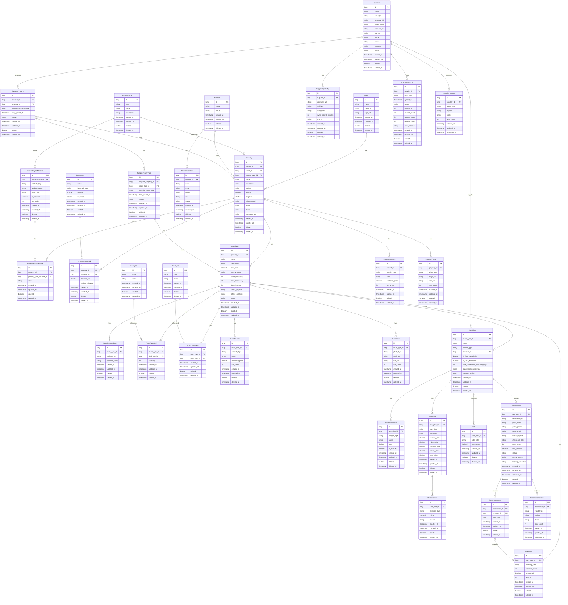

# ERD — OTA 숙박 플랫폼 (v3)

> v2 → v3: 도메인 코드 정합성 동기화. audit/soft-delete 컬럼 전 테이블 추가, 필드명·타입 보정.

```mermaid
erDiagram
    Brand {
        long id PK
        string name
        string name_kr
        string logo_url
        timestamp created_at
        timestamp updated_at
        boolean deleted
        timestamp deleted_at
    }

    PropertyType {
        long id PK
        string code
        string name
        string description
        timestamp created_at
        timestamp updated_at
        boolean deleted
        timestamp deleted_at
    }

    PropertyTypeAttribute {
        long id PK
        long property_type_id FK
        string attribute_key
        string attribute_name
        string value_type
        boolean is_required
        int sort_order
        timestamp created_at
        timestamp updated_at
        boolean deleted
        timestamp deleted_at
    }

    Property {
        long id PK
        long partner_id FK
        long brand_id FK
        long property_type_id FK
        string name
        string description
        string address
        double latitude
        double longitude
        string neighborhood
        string region
        string status
        string promotion_text
        timestamp created_at
        timestamp updated_at
        boolean deleted
        timestamp deleted_at
    }

    PropertyAttributeValue {
        long id PK
        long property_id FK
        long property_type_attribute_id FK
        string value
        timestamp created_at
        timestamp updated_at
        boolean deleted
        timestamp deleted_at
    }

    Landmark {
        long id PK
        string name
        string landmark_type
        double latitude
        double longitude
        timestamp created_at
        timestamp updated_at
        boolean deleted
        timestamp deleted_at
    }

    PropertyLandmark {
        long id PK
        long property_id FK
        long landmark_id FK
        double distance_km
        int walking_minutes
        timestamp created_at
        timestamp updated_at
        boolean deleted
        timestamp deleted_at
    }

    RoomType {
        long id PK
        long property_id FK
        string name
        string description
        decimal area_sqm
        string area_pyeong
        int base_occupancy
        int max_occupancy
        int base_inventory
        string check_in_time
        string check_out_time
        string status
        timestamp created_at
        timestamp updated_at
        boolean deleted
        timestamp deleted_at
    }

    RoomTypeAttribute {
        long id PK
        long room_type_id FK
        string attribute_key
        string attribute_value
        timestamp created_at
        timestamp updated_at
        boolean deleted
        timestamp deleted_at
    }

    BedType {
        long id PK
        string code
        string name
        timestamp created_at
        timestamp updated_at
        boolean deleted
        timestamp deleted_at
    }

    ViewType {
        long id PK
        string code
        string name
        timestamp created_at
        timestamp updated_at
        boolean deleted
        timestamp deleted_at
    }

    RoomTypeBed {
        long id PK
        long room_type_id FK
        long bed_type_id FK
        int quantity
        timestamp created_at
        timestamp updated_at
        boolean deleted
        timestamp deleted_at
    }

    RoomTypeView {
        long id PK
        long room_type_id FK
        long view_type_id FK
        timestamp created_at
        timestamp updated_at
        boolean deleted
        timestamp deleted_at
    }

    PropertyAmenity {
        long id PK
        long property_id FK
        string amenity_type
        string name
        decimal additional_price
        int sort_order
        timestamp created_at
        timestamp updated_at
        boolean deleted
        timestamp deleted_at
    }

    RoomAmenity {
        long id PK
        long room_type_id FK
        string amenity_type
        string name
        decimal additional_price
        int sort_order
        timestamp created_at
        timestamp updated_at
        boolean deleted
        timestamp deleted_at
    }

    PropertyPhoto {
        long id PK
        long property_id FK
        string photo_type
        string origin_url
        string cdn_url
        int sort_order
        timestamp created_at
        timestamp updated_at
        boolean deleted
        timestamp deleted_at
    }

    RoomPhoto {
        long id PK
        long room_type_id FK
        string photo_type
        string origin_url
        string cdn_url
        int sort_order
        timestamp created_at
        timestamp updated_at
        boolean deleted
        timestamp deleted_at
    }

    RatePlan {
        long id PK
        long room_type_id FK
        string name
        string source_type
        long supplier_id FK
        boolean is_free_cancellation
        boolean is_non_refundable
        int free_cancellation_deadline_days
        string cancellation_policy_text
        string payment_policy
        timestamp created_at
        timestamp updated_at
        boolean deleted
        timestamp deleted_at
    }

    RatePlanAddOn {
        long id PK
        long rate_plan_id FK
        string add_on_type
        string name
        decimal price
        boolean is_included
        timestamp created_at
        timestamp updated_at
        boolean deleted
        timestamp deleted_at
    }

    RateRule {
        long id PK
        long rate_plan_id FK
        string start_date
        string end_date
        decimal weekday_price
        decimal friday_price
        decimal saturday_price
        decimal sunday_price
        decimal base_price
        timestamp created_at
        timestamp updated_at
        boolean deleted
        timestamp deleted_at
    }

    RateOverride {
        long id PK
        long rate_rule_id FK
        string override_date
        decimal price
        string reason
        timestamp created_at
        timestamp updated_at
        boolean deleted
        timestamp deleted_at
    }

    Rate {
        long id PK
        long rate_plan_id FK
        string rate_date
        decimal base_price
        timestamp created_at
        timestamp updated_at
        boolean deleted
        timestamp deleted_at
    }

    Inventory {
        long id PK
        long room_type_id FK
        string inventory_date
        int available_count
        boolean is_stop_sell
        int version
        timestamp created_at
        timestamp updated_at
        boolean deleted
        timestamp deleted_at
    }

    Reservation {
        long id PK
        long rate_plan_id FK
        string reservation_no
        string guest_name
        string guest_phone
        string guest_email
        string check_in_date
        string check_out_date
        int guest_count
        decimal total_amount
        string status
        string cancel_reason
        string booking_snapshot
        timestamp created_at
        timestamp updated_at
        timestamp cancelled_at
        boolean deleted
        timestamp deleted_at
    }

    ReservationItem {
        long id PK
        long reservation_id FK
        long inventory_id FK
        string stay_date
        timestamp created_at
        timestamp updated_at
        boolean deleted
        timestamp deleted_at
    }

    Partner {
        long id PK
        string name
        string status
        timestamp created_at
        timestamp updated_at
        boolean deleted
        timestamp deleted_at
    }

    PartnerMember {
        long id PK
        long partner_id FK
        string name
        string email
        string phone
        string role
        string status
        timestamp created_at
        timestamp updated_at
        boolean deleted
        timestamp deleted_at
    }

    Supplier {
        long id PK
        string name
        string name_kr
        string company_title
        string owner_name
        string business_no
        string address
        string phone
        string email
        string terms_url
        string status
        timestamp created_at
        timestamp updated_at
        boolean deleted
        timestamp deleted_at
    }

    SupplierApiConfig {
        long id PK
        long supplier_id FK
        string api_base_url
        string api_key
        string auth_type
        int sync_interval_minutes
        string status
        timestamp created_at
        timestamp updated_at
        boolean deleted
        timestamp deleted_at
    }

    SupplierProperty {
        long id PK
        long supplier_id FK
        long property_id FK
        string supplier_property_code
        timestamp last_synced_at
        string status
        timestamp created_at
        timestamp updated_at
        boolean deleted
        timestamp deleted_at
    }

    SupplierRoomType {
        long id PK
        long supplier_property_id FK
        long room_type_id FK
        string supplier_room_code
        timestamp last_synced_at
        string status
        timestamp created_at
        timestamp updated_at
        boolean deleted
        timestamp deleted_at
    }

    SupplierSyncLog {
        long id PK
        long supplier_id FK
        string sync_type
        timestamp synced_at
        string status
        int total_count
        int created_count
        int updated_count
        int deleted_count
        string error_message
        timestamp created_at
        timestamp updated_at
        boolean deleted
        timestamp deleted_at
    }

    ReservationOutbox {
        long id PK
        long reservation_id FK
        string event_type
        string payload
        string status
        int retry_count
        timestamp created_at
        timestamp updated_at
        timestamp processed_at
    }

    SupplierOutbox {
        long id PK
        long supplier_id FK
        string event_type
        string payload
        string status
        int retry_count
        timestamp created_at
        timestamp updated_at
        timestamp processed_at
    }

    Brand ||--o{ Property : has
    PropertyType ||--o{ Property : categorizes
    PropertyType ||--o{ PropertyTypeAttribute : defines
    Property ||--o{ PropertyAttributeValue : has
    PropertyTypeAttribute ||--o{ PropertyAttributeValue : fills
    Property ||--o{ PropertyLandmark : has
    Landmark ||--o{ PropertyLandmark : referenced
    Partner ||--o{ Property : owns
    Partner ||--o{ PartnerMember : has
    Property ||--o{ RoomType : has
    Property ||--o{ PropertyAmenity : has
    Property ||--o{ PropertyPhoto : has
    RoomType ||--o{ RoomAmenity : has
    RoomType ||--o{ RoomPhoto : has
    RoomType ||--o{ RoomTypeBed : has
    RoomType ||--o{ RoomTypeView : has
    BedType ||--o{ RoomTypeBed : referenced
    ViewType ||--o{ RoomTypeView : referenced
    RoomType ||--o{ RoomTypeAttribute : has
    RoomType ||--o{ RatePlan : has
    RoomType ||--o{ Inventory : has
    RatePlan ||--o{ RatePlanAddOn : has
    RatePlan ||--o{ RateRule : has
    RateRule ||--o{ RateOverride : has
    RatePlan ||--o{ Rate : calculated
    RatePlan ||--o{ Reservation : booked
    Reservation ||--o{ ReservationItem : contains
    ReservationItem }o--|| Inventory : reserves
    Supplier ||--o{ SupplierApiConfig : has
    Supplier ||--o{ SupplierProperty : provides
    Supplier ||--o{ SupplierSyncLog : logs
    Supplier ||--o{ RatePlan : supplies
    SupplierProperty ||--o{ SupplierRoomType : has
    SupplierProperty }o--|| Property : maps
    SupplierRoomType }o--|| RoomType : maps
    Reservation ||--o{ ReservationOutbox : publishes
    Supplier ||--o{ SupplierOutbox : publishes
```
