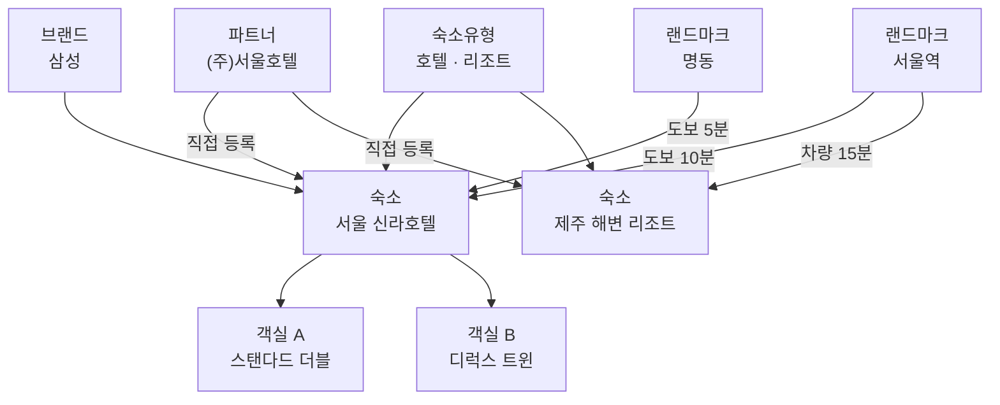
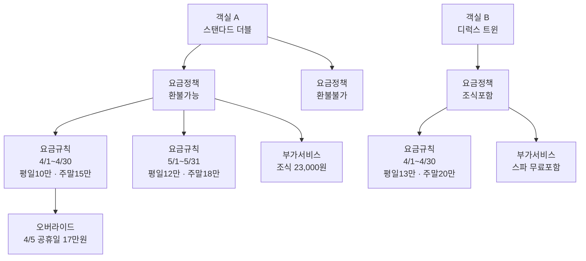
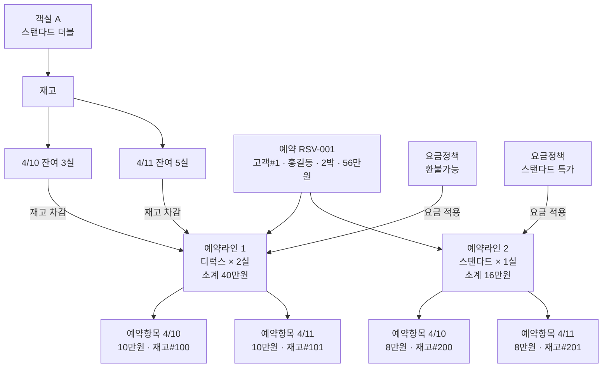
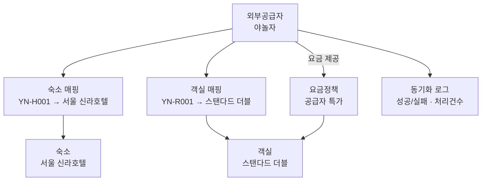
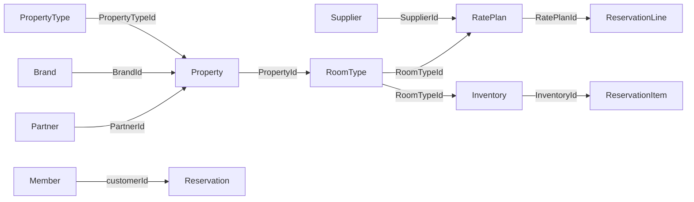

# Domain Module — OTA 숙박 플랫폼 핵심 도메인

> **순수 Java 도메인 모델.** 프레임워크(Spring, JPA) 의존 없이 비즈니스 규칙만 표현한다.

---

## 도메인 관계 다이어그램

### 1. 숙소 등록

파트너가 숙소를 등록하고, 브랜드·랜드마크·숙소유형 등의 메타데이터가 연결된다.



### 2. 가격 설정

객실마다 요금정책을 만들고, 기간별 요금규칙과 특정 날짜 오버라이드로 최종 가격을 결정한다.



### 3. 재고·예약

객실의 날짜별 재고를 관리하고, 요금정책의 가격 + 재고 차감으로 예약이 생성된다.
하나의 예약에 여러 객실 유형을 조합할 수 있다 (디럭스 2실 + 스탠다드 1실).



### 4. 외부 공급자 연동

외부 공급자의 숙소·객실을 자체 데이터에 매핑하고, 공급자 요금정책을 등록한다.



---

## 패키지 구조

```
domain/
├── accommodation/   공유 타입: AmenityType, PhotoType (숙소·객실 공통)
├── brand/           브랜드 (신라, 롯데, 힐튼)
├── common/          공유 VO: Money, DateRange, Email, PhoneNumber, Coordinate 등
├── inventory/       재고 관리 (날짜별 전체/가용 수량, 점유율)
├── location/        랜드마크 + 숙소-랜드마크 거리
├── member/          회원 (이메일 로그인, CUSTOMER/ADMIN 역할)
├── partner/         파트너 (숙소 운영 사업자) + 소속 멤버
├── pricing/         요금 정책 + 요금 규칙 + 오버라이드 + 부가서비스
├── property/        숙소 + 편의시설 + 사진 + 속성값
├── propertytype/    숙소 유형 분류 (호텔/모텔/펜션) + EAV 속성 정의
├── reservation/     예약 + 예약 라인(다객실) + 예약 항목 + 투숙객 정보
├── roomattribute/   침대 유형·전망 유형 마스터
├── roomtype/        객실 유형 + 침대 구성 + 전망 + 편의시설 + 사진
└── supplier/        외부 공급자 + 숙소·객실 매핑 + 동기화 로그
```

---

## Bounded Context별 상세

### 1. 숙소 (Property)

호텔, 모텔, 펜션 등 숙박 시설 하나를 나타낸다.

```
Property (Aggregate Root)
├── PropertyName              ex) "서울 신라호텔"
├── PropertyDescription       ex) "도심 속 최고급 호텔, 남산 전망"
├── PromotionText             ex) "얼리버드 30% 할인"
├── Location                  ex) 서울시 중구 / 37.5, 127.0 / 명동 / 서울
├── PropertyStatus            ACTIVE(운영중) / INACTIVE(비활성)
│
├── PropertyAmenities (PropertyAmenity[])          ex) 수영장, 무료 와이파이, 피트니스, 주차장
├── PropertyPhotos (PropertyPhoto[])               ex) 외관 사진, 로비 사진, 전경 사진
└── PropertyAttributeValues (PropertyAttributeValue[])  ex) 성급=5, 총객실수=300 (숙소 유형별로 다른 속성)
```

- 파트너(사업자)가 등록 → `PartnerId` (필수)
- 어떤 브랜드인지 → `BrandId` (nullable, ex: 삼성)
- 어떤 유형인지 → `PropertyTypeId` (필수, ex: 호텔, 펜션)

---

### 2. 객실 유형 (RoomType)

하나의 숙소 안에서 구분되는 객실 카테고리 (스탠다드/디럭스/스위트).

```
RoomType (Aggregate Root)
├── RoomTypeName              ex) "디럭스 더블"
├── RoomTypeDescription       ex) "시티뷰가 보이는 넓은 객실"
├── areaSqm / areaPyeong      ex) 33.5m² / 10평
├── baseOccupancy / maxOccupancy  기준 2명 / 최대 4명
├── checkInTime / checkOutTime    15:00 입실 / 11:00 퇴실
├── baseInventory             ex) 10개 (이 객실이 총 몇 개인지)
├── RoomTypeStatus            ACTIVE / INACTIVE
│
├── RoomTypeBeds (RoomTypeBed[])           ex) 더블베드 × 1, 싱글베드 × 1
├── RoomTypeViews (RoomTypeView[])        ex) 시티뷰, 오션뷰
├── RoomAmenities (RoomAmenity[])         ex) 미니바, 에어컨, TV, 욕조
├── RoomPhotos (RoomPhoto[])              ex) 침실 사진, 욕실 사진
└── RoomTypeAttributes (RoomTypeAttribute[])  ex) 층수=고층, 흡연여부=불가
```

- 어떤 숙소의 객실인지 → `PropertyId`

> **침대 구성(RoomTypeBeds)**: 고객이 선택하는 옵션이 아니라 객실에 물리적으로 설치된 침대를 의미한다. 각 항목은 침대 유형(bedTypeId)과 수량(quantity)으로 구성되며, 같은 유형을 두 번 등록할 수 없고 수량으로 표현한다. ex) 싱글베드 × 2, 더블베드 × 1. 침대 수량과 maxOccupancy는 별개로 관리된다.

---

### 3. 요금 정책 (Pricing)

동일 객실이라도 요금 조건(환불 여부, 결제 방식)에 따라 가격이 달라진다.

```
RatePlan (Aggregate Root)
├── RatePlanName              ex) "스탠다드 환불가능"
├── SourceType                DIRECT(자체 입점) / SUPPLIER(외부 공급)
├── CancellationPolicy        ex) 체크인 3일 전까지 무료 취소 / 환불 불가
├── PaymentPolicy             PREPAY(선결제) / PAY_AT_HOTEL(현장결제)
│
├── RateRules (RateRule[])     기간별 가격 설정 (기간이 겹치면 안 됨)
│   └── ex) 4/1~4/30: 평일 10만, 금요일 12만, 토요일 15만, 일요일 11만
│       └── RateOverrides (RateOverride[])  특정 날짜 가격 덮어쓰기 (같은 날짜 중복 불가)
│                                           ex) 4/5 공휴일 → 17만원
│
├── Rate[]                    시스템이 계산한 날짜별 최종 가격 스냅샷
│   ├── rateDate              ex) 2026-04-10
│   ├── basePrice             ex) 100,000원
│   └── updatePrice()         재계산 시 가격 갱신
│
└── RatePlanAddOn[]           관리자가 등록하는 부가 서비스
    ├── AddOnType             ex) BREAKFAST, SPA, PARKING
    ├── AddOnName             ex) "조식 뷔페"
    ├── price                 ex) 23,000원 (포함 서비스면 null)
    └── included              true = 무료 포함 / false = 별도 구매
```

- 어떤 객실의 요금인지 → `RoomTypeId` (필수)
- 외부 공급이면 → `SupplierId` (SUPPLIER일 때 필수, DIRECT일 때 null)

**가격 계산 흐름:**
```
요금규칙의 요일별 가격 → 오버라이드가 있으면 덮어쓰기 → 최종 가격 결정
```

---

### 4. 재고 (Inventory)

날짜별, 객실 유형별 가용 수량을 관리한다. 하나의 Inventory는 **특정 객실 유형의 특정 날짜 1행**을 나타낸다.

```
Inventory (Aggregate Root)
├── inventoryDate     ex) 2026-04-10 (해당 날짜)
├── totalInventory    ex) 10 (전체 객실 수)
├── availableCount    ex) 8 (현재 남은 객실 수)
├── totalReserved()   ex) 2 (예약된 수 = total - available, 파생값)
├── stopSell          true/false (수동 판매 중지 여부)
├── version           낙관적 잠금 (동시 예약 충돌 방지)
│
├── decrease(count)           ← 예약 시 재고 차감 (roomCount만큼)
├── restore(count)            ← 취소 시 재고 복구 (totalInventory 초과 불가)
├── updateAvailableCount(n)   ← 파트너가 가용 수량 직접 설정 (total 이하)
├── updateTotalInventory(n)   ← 전체 객실 수 변경 (예약 수 이상)
├── stopSell()                ← 판매 중지
├── resumeSell()              ← 판매 재개
└── isAvailable()             ← !stopSell && availableCount > 0
```

- 어떤 객실의 재고인지 → `RoomTypeId` (필수)
- `version` 필드로 동시 예약 요청 시 충돌 감지 (Optimistic Locking)
- `totalInventory`로 전체 수량을 관리하여 점유율 계산과 복원 상한선 체크가 가능하다

> **재고 관리 방식**: "디럭스 더블" 객실이 10개이고, 4/10~4/12 3박이면 `Inventory` 행이 3개 생긴다 (4/10, 4/11, 4/12). 예약 시 해당 날짜 행마다 `decrease(roomCount)`로 차감하고, 취소 시 `restore(roomCount)`로 복구한다. 복구 시 `totalInventory`를 초과할 수 없다. 판매 중지(`stopSell`) 상태에서는 차감이 불가하지만 복구는 허용된다 (재고 정합성 우선).

---

### 5. 예약 (Reservation)

고객이 숙소를 예약한 건 하나를 나타낸다.
하나의 예약에 여러 객실 유형을 조합할 수 있다 (디럭스 2실 + 스탠다드 1실).

```
Reservation (Aggregate Root)
├── customerId (long)              ← 고객 식별자 (필수, 1 이상)
├── ReservationNo                  ← 멱등성 키 (중복 예약 방지)
├── GuestInfo (이름, PhoneNumber, Email)  ← VO (투숙객 정보)
├── DateRange (체크인 ~ 체크아웃)   ← VO
├── guestCount                     ← 투숙 인원
├── Money totalAmount              ← 결제 총액 (모든 라인의 소계 합)
├── bookingSnapshot                ← 예약 시점 정보 스냅샷 (JSON)
├── ReservationStatus              ← 상태 머신 (아래 참조)
│
└── ReservationLine[]              ← 객실 유형별 예약 단위
    ├── RatePlanId                 ← 적용 요금 정책
    ├── roomCount                  ← 해당 유형 객실 수 (ex: 디럭스 2실)
    ├── Money subtotalAmount       ← 이 라인의 소계
    │
    └── ReservationItem[]          ← 날짜별 예약 항목
        ├── stayDate               ← 숙박 날짜
        ├── Money nightlyRate      ← 해당 박 1실 가격
        └── InventoryId            ← 차감한 재고 참조
```

- `customerId`로 예약한 고객을 식별한다. 예약자와 투숙객(GuestInfo)은 다를 수 있다.
- `ReservationLine`이 요금 정책(RatePlanId)을 보유한다. 하나의 예약에 서로 다른 요금 정책의 라인을 조합할 수 있다.
- 재고 차감 시 `inventory.decrease(line.roomCount())`로 라인의 객실 수만큼 차감한다.
- 결제(Payment) 도메인은 현재 구현 범위 밖이며, Application 레이어에서 Port로 추상화할 예정이다.

**예약 상태 흐름 (State Machine):**
```
PENDING ──confirm()──▶ CONFIRMED ──complete()──▶ COMPLETED
   │                      │
   │ cancel()             │ cancel()
   ▼                      ▼
CANCELLED             CANCELLED

                   CONFIRMED ──noShow()──▶ NO_SHOW
```

**비즈니스 규칙:**
- 고객 ID는 1 이상이어야 한다
- 체크인 날짜가 과거면 예약 불가
- 최대 30박까지 예약 가능
- 객실 수(roomCount)는 1 이상이어야 한다
- 이미 취소된 예약 재취소 시 `ReservationAlreadyCancelledException`
- 이미 완료된 예약 취소 시 `ReservationAlreadyCompletedException`

---

### 6. 회원 (Member)

이메일로 로그인하는 플랫폼 회원. 고객(CUSTOMER)과 관리자(ADMIN) 역할을 구분한다.

```
Member (Aggregate Root)
├── MemberEmail                    ← 로그인 ID (unique)
├── MemberPassword                 ← 해시된 비밀번호 (해싱은 Adapter에서 수행)
├── MemberName                     ← 회원 이름
├── MemberRole (CUSTOMER / ADMIN)  ← 인가 역할
├── MemberStatus (ACTIVE ↔ SUSPENDED)  ← 상태 머신
│
├── changePassword()               ← 비밀번호 변경
├── changeName()                   ← 이름 변경
├── suspend() / activate()         ← 상태 전이
├── isActive() / isAdmin()         ← 판단 메서드
```

- 비밀번호 해싱/검증은 도메인 외부(Application/Adapter)의 관심사. 도메인은 해시값만 보관한다.
- Reservation의 `customerId`는 `Member.id().value()`를 참조한다.

---

### 7. 파트너 (Partner)

숙소를 등록하고 관리하는 사업자.

```
Partner (Aggregate Root)
├── PartnerName                    ← VO
├── PartnerStatus (ACTIVE ↔ SUSPENDED)  ← 상태 머신
│
└── PartnerMember[]                ← 소속 직원
    ├── MemberName, Email, PhoneNumber
    ├── PartnerMemberRole (OWNER / MANAGER / STAFF)
    └── PartnerMemberStatus (ACTIVE / INACTIVE)
```

---

### 8. 외부 공급자 (Supplier)

야놀자, 부킹닷컴 등 외부 채널에서 숙소/객실/요금을 공급하는 사업자.

```
Supplier (Aggregate Root)
├── SupplierName, SupplierNameKr   ← VO (영문명, 한글명)
├── CompanyTitle, BusinessNo       ← VO (법인명, 사업자번호)
├── OwnerName                      ← VO (대표자명)
├── SupplierStatus (ACTIVE → SUSPENDED → TERMINATED)  ← 상태 머신
│
├── SupplierProperty[]             ← 공급자 숙소 ↔ 자체 숙소 매핑
├── SupplierRoomType[]             ← 공급자 객실 ↔ 자체 객실 매핑
└── SupplierSyncLog[]              ← 데이터 동기화 이력
```

---

### 9. 참조 마스터 데이터

독립적으로 관리되며, 다른 BC에서 ID로 참조한다.

| BC | Aggregate | 역할 | 예시 |
|----|-----------|------|------|
| brand | Brand | 숙박 브랜드 | 신라, 롯데, 힐튼 |
| propertytype | PropertyType | 숙소 유형 분류 + EAV 속성 정의 | 호텔, 모텔, 펜션 |
| roomattribute | BedType | 침대 유형 마스터 | 싱글, 더블, 킹 |
| roomattribute | ViewType | 전망 유형 마스터 | 시티뷰, 오션뷰 |
| location | Landmark | 주요 지점 + 숙소까지 거리 | 서울역, 인천공항 |

---

## BC 간 참조 관계

모든 BC 간 참조는 **ID VO**를 통해 이루어진다. 객체를 직접 참조하지 않아 BC 간 결합도를 최소화한다.

```
Partner ──PartnerId──────▶ Property
Brand ──BrandId──────────▶ Property
PropertyType ──PropertyTypeId──▶ Property
Property ──PropertyId────▶ RoomType
BedType ──BedTypeId──────▶ RoomType
ViewType ──ViewTypeId────▶ RoomType
RoomType ──RoomTypeId────▶ RatePlan, Inventory
Supplier ──SupplierId────▶ RatePlan
Member ──customerId(long)──▶ Reservation
RatePlan ──RatePlanId────▶ ReservationLine
Inventory ──InventoryId──▶ ReservationItem
Landmark ──propertyId────▶ PropertyLandmark (long, 컴파일 의존 제거)
```



---

## 핵심 설계 패턴

| 패턴 | 적용 위치 | 목적 |
|------|----------|------|
| **Aggregate Root** | Property, RoomType, RatePlan, Inventory, Reservation, Partner, Supplier | 트랜잭션 경계, 불변식 보장 |
| **Value Object** | Money, DateRange, Email, PhoneNumber, Coordinate, 각종 Name/Id VO | 동등성 기반 비교, 불변 |
| **일급 컬렉션** | PropertyAmenities, RoomTypeBeds, RoomTypeViews, RateRules 등 | 컬렉션 자체의 검증 로직 캡슐화 |
| **상태 머신** | ReservationStatus, SupplierStatus, PartnerStatus | 유효한 상태 전이만 허용 |
| **낙관적 잠금** | Inventory.version | 동시 예약 시 재고 충돌 감지 |
| **멱등성 키** | ReservationNo | 중복 예약 방지 |
| **EAV 패턴** | PropertyType → PropertyTypeAttribute → PropertyAttributeValue | 유형별 유연한 속성 확장 |
| **팩토리 메서드** | `forNew()` / `reconstitute()` | 신규 생성(검증O) vs DB 복원(검증X) 분리 |

---

## 공유 Value Object

`common` 패키지에서 도메인 전체가 공유하는 타입들:

| VO | 설명 | 사용처 |
|----|------|--------|
| Money | 금액 (BigDecimal 래핑, 음수 불가) | 요금, 예약 총액, 편의시설 추가요금 |
| DateRange | 날짜 범위 (시작~종료, nights() 계산) | 예약 숙박 기간 |
| Coordinate | 위도/경도 좌표 | 숙소 위치, 랜드마크 위치 |
| Email | 이메일 주소 (@ 포함 검증) | 파트너 멤버, 투숙객 정보 |
| PhoneNumber | 전화번호 (숫자+하이픈 검증) | 파트너 멤버, 투숙객 정보 |
| OriginUrl / CdnUrl | 이미지 URL | 숙소 사진, 객실 사진 |

---

## 핵심 비즈니스 흐름

### 예약 생성 흐름

```
1. 고객(customerId)이 객실·날짜·요금 정책 선택 (복수 객실 유형 가능)
2. 각 객실 유형마다:
   a. RatePlan → RateRule에서 날짜별 가격 계산 (RateOverride 적용)
   b. Inventory에서 날짜별 재고 확인 + decrease(roomCount) 차감 (낙관적 잠금)
   c. ReservationLine 생성 (ratePlanId, roomCount, subtotalAmount)
      └── ReservationItem × 숙박일수 (각 항목에 nightlyRate 기록)
3. Reservation 생성 (PENDING 상태, totalAmount = 모든 라인 소계 합)
4. 결제 완료 → confirm() → CONFIRMED
```

### 공급자 데이터 동기화 흐름

```
1. 외부 공급자(야놀자, 부킹닷컴)의 숙소·객실 데이터 수신
2. SupplierProperty / SupplierRoomType으로 자체 데이터와 매핑
3. 공급자 요금 → RatePlan(SourceType=SUPPLIER)으로 등록
4. SupplierSyncLog에 동기화 이력 기록
```
